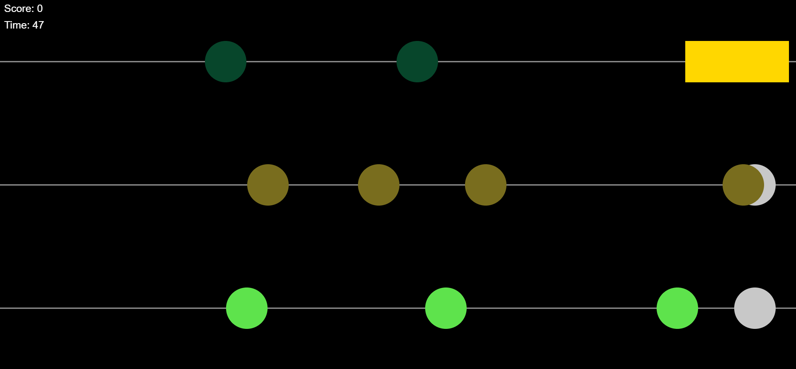

# Click the Notes

p5.jsを用いて制作した、3レーン形式のリズムゲーム。

制作期間：1週間

大学課題として制作

---

# 概要

本プロジェクトは、プログラミング基礎授業で学習した内容を活用し、実際にゲームとしてアウトプットすることを目的として制作しました。

プレイヤーは流れてくるノーツをクリックし、制限時間内に高得点を目指します。

本作では、単純なクリックゲームではなく、ランダム生成・タイミング判定・特殊ノーツなどを実装し、遊びながらプログラミング理解を深めることを目的としています。

---

# スクリーンショット / プレイリンク

[（ブラウザプレイリンク追加）](https://openprocessing.org/@u405190/2316196)

---

# ゲームプレイ

プレイヤーは3つのレーンを流れるノーツをクリックしてスコアを獲得します。

ゲーム要素：

* 3レーン構成
* スコアシステム
* 制限時間システム
* ランダムノーツ生成
* 特殊ノーツシステム
* 効果音フィードバック

---

## 操作方法

マウスクリック : ノーツをクリック

特殊ノーツ :

* 円を長押しして判定
* 長押し成功で高得点

---

# システム

通常ノーツ：

* クリック成功で得点

特殊ノーツ：

* 長押し判定
* 高得点付与

ゲーム終了条件：

* 制限時間終了

---

# 使用技術

言語：

* JavaScript

ライブラリ：

* p5.js

その他：

* Audio Integration
* Random Generation

---

# 学んだこと

本プロジェクトを通して、プログラミングによってゲームを制作する難しさを初めて実感しました。

特に、

* ゲームロジック設計
* ランダム要素実装
* タイミング判定
* 状態管理

について理解を深めることができました。

また、ゲームにおいてランダム性がプレイ体験へ与える影響についても学ぶことができました。

プログラミング学習の成果を形にしながら、楽しみながら制作できたプロジェクトです。